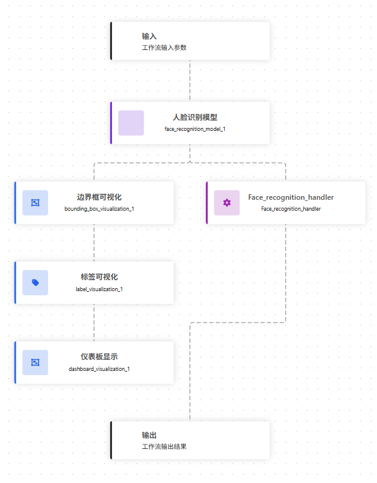
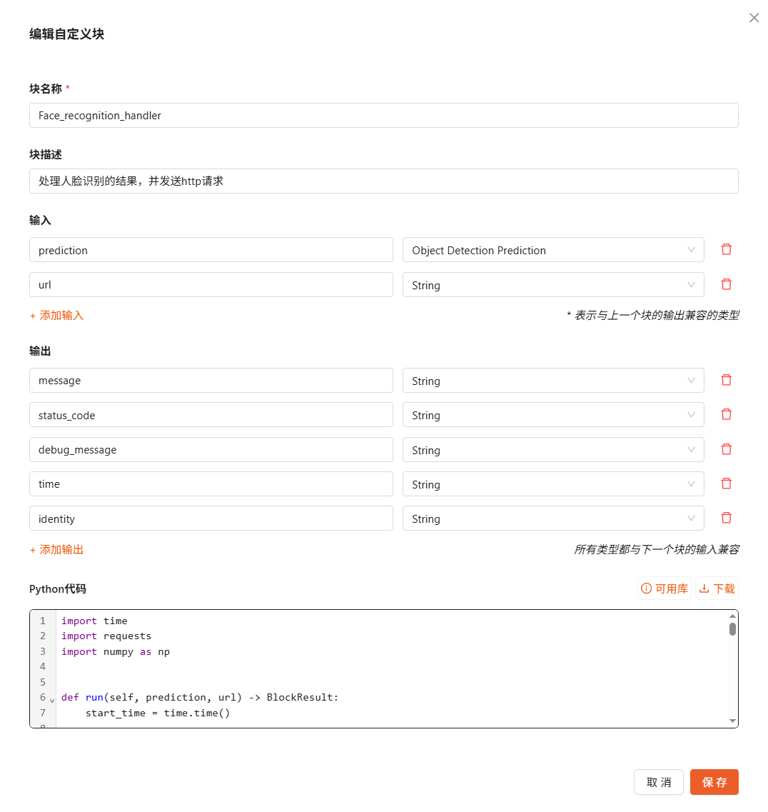

Python 动态模块外部通信方法
===================================

本案例演示如何在工作流中通过 Python 动态模块将识别结果可靠地推送到外部系统，涵盖 HTTP 与 WebSocket 两类常见通信方式。

组成与流程
----------

1) 人脸识别模块：运行，输出人脸预测与身份信息（含 unknown 判定）。
2) 边界框可视化：绘制检测框以便查看识别位置。
3) 标签可视化：在图像上叠加类别标签（身份名称）。
4) 仪表盘展示：将可视化图像推送到仪表盘页面。
5) 自定义 Python 模块：整理身份识别结果，构造消息并向外部服务 `url` 发送 HTTP POST；返回状态码与调试信息。

工作流定义
----------

.. dropdown:: 查看工作流 JSON
    :icon: code
    :color: primary

    .. literalinclude:: python_communication.json
       :language: json
       :linenos:

外部通信示例
---------------

下面给出两种常见通信方式的参考实现，可直接复制到 Python 动态模块中使用。请根据实际需求修改目标 `url` 地址与消息内容格式。

HTTP 通信
^^^^^^^^^^^^^^^^

示例：使用 HTTP POST 发送当前时间戳。

.. code-block:: python

    import time
    import requests

    def run(self) -> BlockResult:
        url = "http://127.0.0.1:8000/event"  # 按需修改

        payload = {
            "timestamp": int(time.time() * 1000)
        }

        try:
            response = requests.post(url, json=payload, timeout=5)

            return {
                "message": f"sent timestamp_ms {payload['timestamp']}",
                "status_code": response.status_code
            }

        except Exception as e:
            return {
                "message": str(e),
                "status_code": -1
            }

WebSocket 通信
^^^^^^^^^^^^^^^^^^^^^

使用原生库实现的最小 WebSocket 客户端，同样以发送当前时间戳为例。

.. code-block:: python

    import os
    import ssl
    import time
    import json
    import base64
    import socket
    import hashlib
    from urllib.parse import urlparse

    def _ws_send_text_once(ws_url: str, text: str, timeout: float = 5.0) -> None:
        u = urlparse(ws_url)
        if u.scheme not in ("ws", "wss"):
            raise ValueError(f"Unsupported scheme: {u.scheme}")

        host = u.hostname
        port = u.port or (443 if u.scheme == "wss" else 80)
        path = u.path or "/"
        if u.query:
            path += "?" + u.query

        # 1) TCP connect (+ TLS if wss)
        sock = socket.create_connection((host, port), timeout=timeout)
        if u.scheme == "wss":
            ctx = ssl.create_default_context()
            sock = ctx.wrap_socket(sock, server_hostname=host)

        try:
            # 2) WebSocket handshake
            key = base64.b64encode(os.urandom(16)).decode("ascii")
            req = (
                f"GET {path} HTTP/1.1\r\n"
                f"Host: {host}:{port}\r\n"
                f"Upgrade: websocket\r\n"
                f"Connection: Upgrade\r\n"
                f"Sec-WebSocket-Key: {key}\r\n"
                f"Sec-WebSocket-Version: 13\r\n"
                f"\r\n"
            )
            sock.sendall(req.encode("utf-8"))

            # Read handshake response headers
            buf = b""
            while b"\r\n\r\n" not in buf:
                chunk = sock.recv(4096)
                if not chunk:
                    raise RuntimeError("Handshake failed: connection closed")
                buf += chunk

            header_blob = buf.split(b"\r\n\r\n", 1)[0].decode("iso-8859-1")
            lines = header_blob.split("\r\n")
            status_line = lines[0]
            if " 101 " not in status_line:
                raise RuntimeError(f"Handshake failed: {status_line}")

            headers = {}
            for line in lines[1:]:
                if ":" in line:
                    k, v = line.split(":", 1)
                    headers[k.strip().lower()] = v.strip()

            accept = headers.get("sec-websocket-accept")
            if not accept:
                raise RuntimeError("Handshake failed: missing Sec-WebSocket-Accept")

            magic = "258EAFA5-E914-47DA-95CA-C5AB0DC85B11"
            expected = base64.b64encode(hashlib.sha1((key + magic).encode("ascii")).digest()).decode("ascii")
            if accept != expected:
                raise RuntimeError("Handshake failed: bad Sec-WebSocket-Accept")

            # 3) Send a single masked text frame
            payload = text.encode("utf-8")
            if len(payload) > 125:
                raise ValueError("This minimal client supports payload length <= 125 bytes")

            fin_opcode = 0x81  # FIN=1, opcode=1(text)
            mask_bit_len = 0x80 | len(payload)  # MASK=1 + payload len
            mask_key = os.urandom(4)
            masked = bytes(b ^ mask_key[i % 4] for i, b in enumerate(payload))

            frame = bytes([fin_opcode, mask_bit_len]) + mask_key + masked
            sock.sendall(frame)

        finally:
            try:
                sock.close()
            except Exception:
                pass

    def run(self) -> BlockResult:
        ws_url = "ws://127.0.0.1:8000/ws"  # 按需改
        try:
            # 毫秒级时间戳
            ts_ms = int(time.time() * 1000)

            _ws_send_text_once(ws_url, str(ts_ms), timeout=5.0)

            return {
                "status_code": 0,
                "message": f"sent timestamp_ms {ts_ms}"
            }

        except Exception as e:
            return {
                "status_code": -1,
                "message": str(e)
            }

