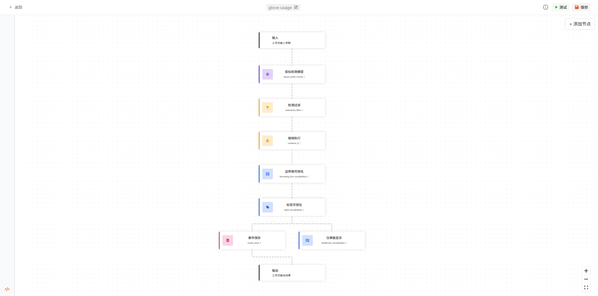

什么是 DaoAI 工作流？
=====================

DaoAI 工作流是一个生态系统，允许用户使用各种可插拔和可重用的模块来创建机器学习应用程序。
这些模块以一种便于用户设计和连接不同组件的方式组织。
图形化界面使用户能够直观地构建工作流，而无需广泛的技术专业知识。
一旦工作流设计完成，工作流引擎将运行应用程序，确保所有组件无缝协作。
这使得从原型到生产就绪解决方案的过渡变得快速，并允许用户快速迭代和部署应用程序。

DaoAI 提供了不断增长的工作流模块选择。
这确保了生态系统的持续扩展和发展。此外，DaoAI 提供灵活的部署选项，包括本地部署和基于云的解决方案，
使用户能够在最适合其需求的环境中部署应用程序。

通过工作流，您可以：

- 使用最先进的模型检测、分类和分割图像中的对象。
- 在工作流的任何阶段使用大型多模态模型（LMMs）进行决策。
- 引入业务逻辑元素，将模型预测转换为您的领域语言。

:ref:`探索全部工作流模块`

在本节文档中，我们将介绍创建和运行工作流所需了解的一切。让我们开始吧！

todo
接下来，创建并运行一个工作流，或者浏览工作流示例。

