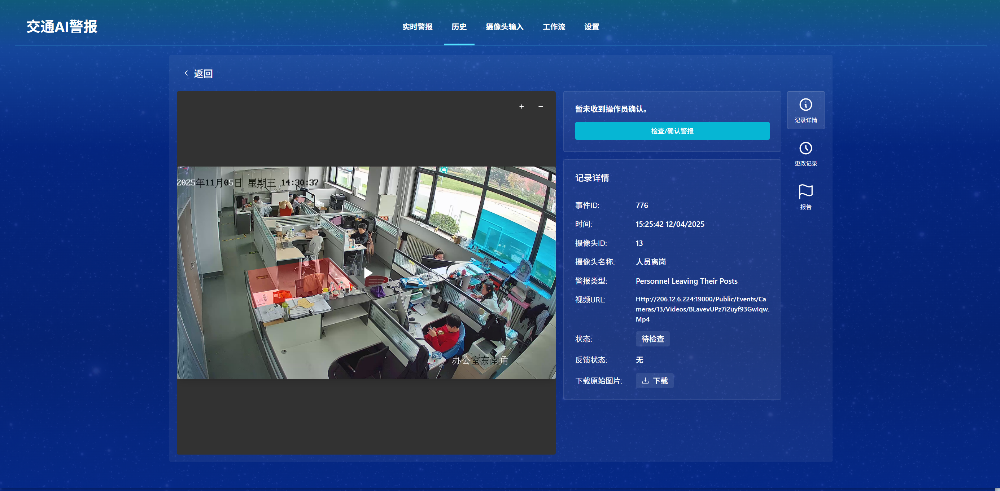
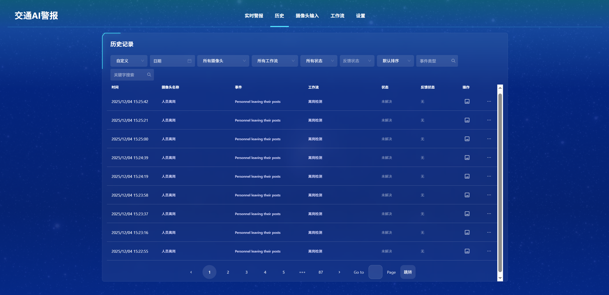
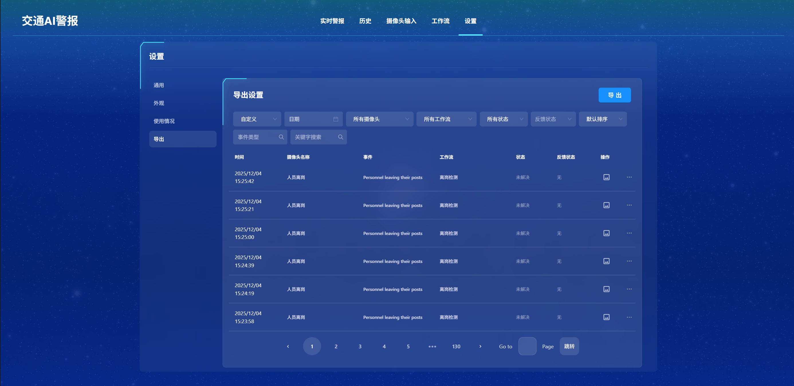

查看报警记录
====================

您可以在 **实时警报** 页面查看当前产生的报警条目，点击任意一条即可打开报警详情。
也可以通过顶部导航进入 **历史** 页面，查看所有历史报警记录并支持筛选与导出。

报警详情包含以下信息：

- 事件可视化图片：在详情页可播放事件发生前后 **15 秒** 的视频片段；
- 记录基础信息：
	- 事件 ID
	- 发生时间
	- 摄像头 ID
	- 摄像头名称
	- 警报类型（由工作流里的事件记录模块定义）
	- 视频 URL
	- 当前状态
	- 反馈状态
	- 原始图片下载

在详情页面的操作
-----------------

- 确认并处理警报：操作员可将报警标记为 **已解决**；
- 添加备注：记录现场检查情况或处理建议，便于后续追踪；
- 变更状态：从“待检查”切换为“处理中 / 已解决”等，纳入流程化管理。

历史记录筛选与查询
--------------------

在 **历史** 页面，支持使用过滤器进行精准查询：

- 按日期范围；
- 按摄像头名称；
- 按工作流名称；
- 按状态（待检查 / 处理中 / 已解决等）；
- 按事件类型（如“人员离岗”“进入禁区”等）。

提示：支持导出查询结果为 CSV/JSON（若已在系统中启用），便于报表与复盘。

数据导出
-----------------

- 在页面右上角的 **设置** → **导出** 中，可以导出报警事件数据；
- 支持先使用过滤器筛选（按日期、摄像头、工作流、状态、事件类型），再导出对应的报警记录；
- 导出格式为 **CSV** 文件，便于在 Excel 或 BI 工具中进行统计分析。