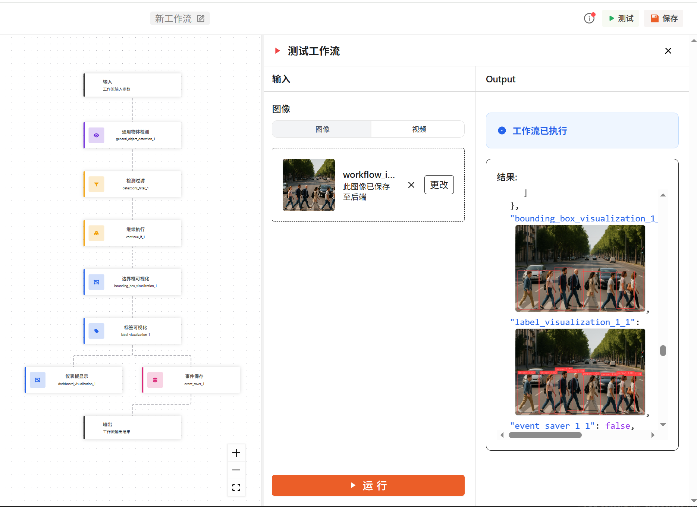

运行工作流
========================

本章节介绍在 DaoAI 天眼系统中，如何以不同方式部署与运行工作流，覆盖在线实时、批处理、HTTP API 调用与边缘/本地部署等典型场景。

.. contents::
	 :local:
	 :depth: 2

在平台中直接运行
------------------------------

最简单的方式是在平台的工作流界面直接运行：

1. 进入 ``工作流``，选择或创建一个工作流。
2. 在编辑画布中点击右上角的“运行 / 测试”，按提示上传图片。
3. 在右侧“输出”面板中查看可视化结果与执行状态。

适用场景：快速验证流程、演示与调参；无需额外集成代码。

通过相机运行（实时监控与告警）
-----------------------------

按照以下步骤，将相机接入并实时运行工作流：

    .. image:: images/camera_input.png
       :alt: Camera Input
       :width: 60%

1. 在主页顶部导航栏，点击 **“摄像头输入”** 进入相机管理页面。
2. 点击 **“新增摄像头”**，填写：
	- 相机名称；
	- RTSP 视频流地址；
    - 视频解码设备（CPU / GPU）：默认使用 CPU 解码，原因是部分场景下 GPU 资源有限，且可能与模型推理产生资源竞争。
	- 选择一个要运行的工作流；
	- 配置 FPS 参数（每秒检测次数）。
3. 保存后，点击 **“运行相机”** 启动实时推理。

在实时展示与告警页面：
    .. image:: images/realtime_dashboard.png
       :alt: Realtime Dashboard
       :width: 80%

1. 进入主页顶部导航栏的 **“实时警报”** 页面。
2. 点击下方的 **管理推流** 按钮，选择刚才已运行的相机。
3. 在监控大屏即可看到实时画面与事件；支持添加多个相机并切换 **4 分屏** 、 **9 分屏** 等多视角布局。

页面信息布局说明：

- 左侧显示 **按日/按周的事件分析图（daily / weekly event analysis graph）**；
- 右侧显示 **实时事件列表（real-time event list）**，可及时查看告警条目与状态。

HTTP API 调用（系统内置 REST 接口）
----------------------------------

对于需要从外部系统触发工作流的场景，可通过平台提供的 HTTP API 调用已保存的工作流。

参考接口文档：

- ``http://<服务器IP>:38080/docs``

调用步骤：

1. 在 DaoAI 天眼系统中保存工作流后，记录其 ``workflow_id``（打开工作流，在浏览器地址栏即可查看并获取）。
2. 使用 HTTP 客户端（cURL、Postman、后端服务）向 ``POST /workflows/{workflow_id}/run`` 接口发起请求。
3. 根据接口规范，使用 ``multipart/form-data`` 上传请求体，其中：
   - ``input_image``：二进制图片文件（``string($binary)``）；
   - ``test_definition``：工作流测试定义（字符串），用于指定本次运行的输入映射或参数。

请求示例（multipart/form-data；请按实际接口文档调整字段与鉴权方式）：

.. code-block:: bash

   curl --location \
        --request POST "http://<server_ip>:38080/workflows/<workflow_id>/run" \
        --header "Content-Type: multipart/form-data" \
        --form "input_image=@C:/path/to/your/image.jpg" 

说明：

- 若使用 Postman，请选择 ``form-data`` 模式，``input_image`` 类型设为 File，``test_definition`` 类型设为 Text 并填入 JSON 字符串。

返回结果：

- 成功时返回工作流输出字典（例如 JSON 字段、多媒体 URL 等），字段名与工作流定义的 ``outputs`` 对应；
- 若可视化产生较大图像，建议仅返回 URL（由服务端写入对象存储），以降低响应体积。

