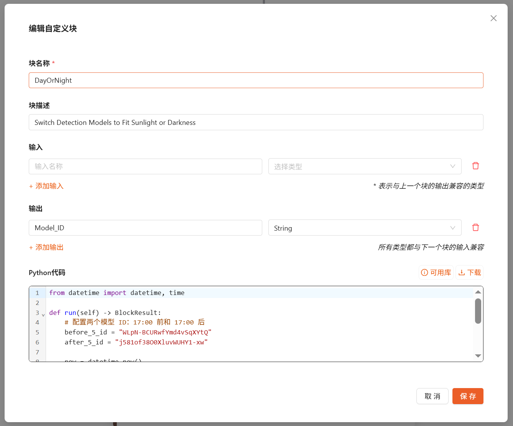
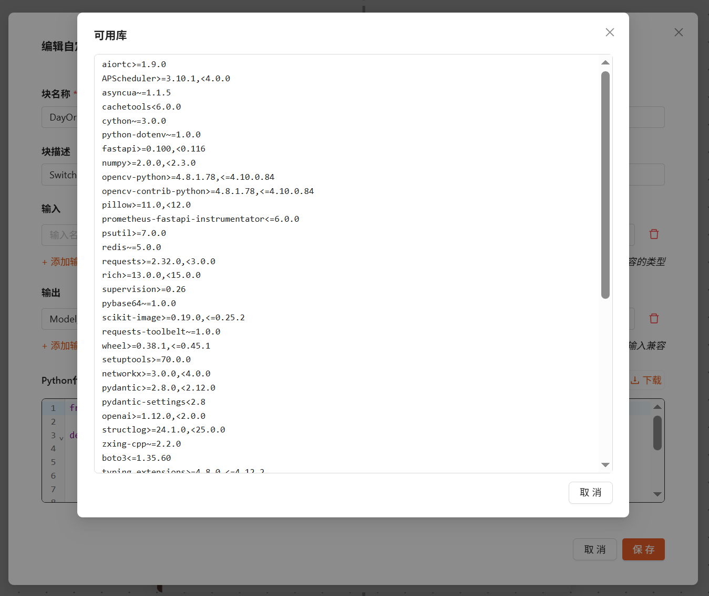

自定义 Python 模块
==============================

本章节介绍如何在 DaoAI 天眼系统的工作流中编写与使用“自定义Python 模块”（Custom Python Blocks）。
通过自定义 Python 代码，您可以实现特定业务逻辑、后处理、数据转换、与外部系统交互等能力，并与平台内置模块一起构建完整的 AI 视觉工作流。

.. contents::
	 :local:
	 :depth: 2

适用场景
--------

- 内置模块无法覆盖的业务规则或特定算法逻辑；
- 对模型输出进行后处理（筛选、聚合、统计、重排）；
- 将工作流结果转为下游系统可用的数据格式；
- 轻量的外部调用（如 HTTP 请求）或状态记录（注意时延与可靠性）。

状态管理最佳实践
------------------

在自定义 Python 模块中，状态（state）主要用于缓存高成本计算和优化工件、依赖的加载：

- 不要依赖状态进行关键数据持久化：重要数据请使用外部存储（数据库、对象存储等）；
- 状态可能随时丢失：服务器重启或容器弹性伸缩都会导致状态丢失；
- 初始化默认值：为模块作用域内的变量设置合理默认值，以应对“冷启动”；
- 保持状态轻量：大型对象会占用内存并影响性能。

原理概述（Theory）
------------------

自定义 Python 模块的高层工作机制如下：

1. 用户以 JSON 文档形式提供动态模块的定义；
2. 该定义包含由执行引擎（Execution Engine）构造 WorkflowBlockManifest 与 WorkflowBlock 所需的信息；
3. 在运行时，编译器（Compiler）会将该定义转译为动态创建的 Python 类——其行为等同于静态定义的模块；
4. 在工作流定义中，您可以像使用标准静态模块一样声明与连接动态模块步骤。

创建一个 Python 模块
--------------------

您可以在工作流编辑器中添加“Python 模块”并填写代码。一个典型的 Python 模块包含：

- 参数定义：作为模块的可配置项（例如检测结果、布尔条件或整数参数等）；
- 入口方法：平台在运行时调用该方法，传入工作流的输入与模块参数；
- 返回值：返回 JSON 可序列化的结构，供后续模块或输出使用。

可用的标准库与依赖
--------------------

在python模块编辑页面，您可以点击 可用库 查看当前环境支持的标准库与第三方依赖包列表。

请避免使用未列出的包，以免运行时报错。

示例：根据当前时间切换昼夜两种模型
------------------------------------

下面示例展示一个最简单的 Python 模块：获取当前时间，并根据时间段返回不同的模型ID, 来切换昼夜两种模型。

.. code-block:: python

	 # 参数示例（在编辑器中以键值方式填写）：
	 # min_confidence: float = 0.5  # 仅统计置信度 >= 0.5 的目标

    from datetime import datetime, time

    def run(self) -> BlockResult:
        # 配置两个模型 ID：17:00 前和 17:00 后
        before_5_id = "WLpN-BCURwfYmd4vSqXYtQ"
        after_5_id = "j581of38O0XluvWUHY1-xw"

        now = datetime.now()
        five_pm = time(23, 5)
        model_id = ""
        if now.time() < five_pm:
            model_id = before_5_id
        else:
            model_id = after_5_id
        return {"Model_ID": model_id}

在工作流中的连接方式：

- 将模型节点的模型ID 输入端连接该 Python 模块的 ``Model_ID`` 输出字段。

示例：统计目标数量并用http请求发送
----------------------------------------

示例说明：

- 功能描述：
    - 从 ``prediction`` 中统计类别为 ``car`` 的目标数量，并以 JSON 负载通过 ``input_url`` 向外部 HTTP 服务发送；
    - 返回外部服务的 ``status_code`` 与 ``message``，便于在日志或事件保存模块中记录。

.. code-block:: python

    import requests
    import numpy as np

    def run(self, input_url, prediction) -> BlockResult:
        url = input_url

        car_number = int(np.sum(prediction.data['class_name'] == "car"))
        payload = {
            "number_of_cars_detected": car_number
        }

        try:
            response = requests.post(
                url=url,
                json=payload,
                timeout=5
            )

            return {
                "status_code": response.status_code,
                "message": response.text
            }

        except Exception as e:
            return {
                "status_code": -1,
                "message": str(e)
            }

