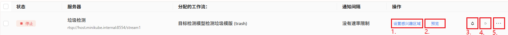

部署界面
============

在部署界面，您可以创建，管理，删除您的监控相机，并且分配一个检测工作流。

    .. image:: images/deployment.png
        :scale: 80%

新建设备
--------------

点击右侧的新建设备

    .. image:: images/create_device.png
        :scale: 80%

输入服务器名称， RTSP视频流地址，以及选择一个检测工作流。

然后点击创建即可。

设备管理
-----------

设备创建后，可以在列表中查看。

1. 设置感兴趣的区域:
    .. image:: images/roi.png
        :scale: 80%

    在画面中绘制一个区域，然后保存。区域以外的检测结果将被过滤掉。只保留检测区域内的结果。

    .. note::
        ROI 定义以后，需要确保工作流中 第一个模块是 ROI 模块。

2. 预览:
    点击即可预览视频流的一帧，以确保可以连通视频流。

    .. image:: images/preview.png
        :scale: 80%

3. 通知:
    点击开启/关闭通知推送。

4. 运行:
    点击 开始/停止 运行。

5. 设置:
    更改设备设置。

    .. image:: images/setting.png
        :scale: 80%

    可以重新设置，名称，RSTP视频流地址，工作流；以及是否开启通知推送，和设置通知间隔。

