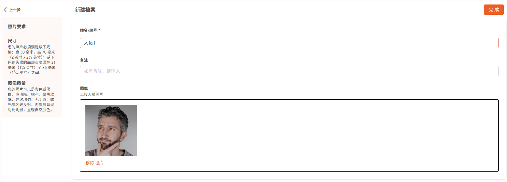

注册人脸身份
=================

在DaoAI World的设置页面，可以点击人脸身份库。

    .. image:: images/facial.png
        :scale: 80%

注册新档案
----------------------

点击左侧菜单中的 **人脸识别**，进入人脸库管理模块。点击【注册新档案】，进入如下页面：

字段说明
----------------------

- **姓名/ID** （必填）：输入该员工的识别唯一标识（如姓名、工号等）
- **备注** （选填）：可用于填写所属班组、角色等描述信息
- **图片** （必填）：支持以下两种方式上传图像：

1. 拖拽人脸图像到上传框内
2. 点击【选择文件】上传本地图片
3. 或点击【使用摄像头】通过 USB 摄像头现场拍照

照片要求
----------------------

为确保后续识别效果，上传照片需满足以下标准：

**图像质量**

- 图像必须清晰、对焦准确，不可模糊
- 支持彩色或黑白图像，背景清晰，无反光，无阴影
- 避免强光直射或逆光，应保证脸部与背景明暗区分清晰
- 建议正面直视，展现完整面部特征

注意事项
----------------------

- 每个用户仅需注册一次，系统会自动提取并存储特征向量
- 建议优先使用高清摄像头采集，以提升后续识别准确率
- 如需删除已注册人员，请返回识别库主界面，点击人员头像管理