创建与编辑工作流指南
==================================

天眼系统通过可视化工作流管理视频流分析任务。本文档将指导您如何创建、编辑并使用工作流。

前置条件
--------

.. note::
   您需要具备管理员权限才能使用工作流相关功能。

创建工作流
----------------

1. 登录天眼系统。
2. 点击左侧导航栏中的 **“工作流”**。
3. 点击右上角的 **“创建工作流”** 按钮，或选择 **“模板”** 标签页，从现有模板中快速开始。

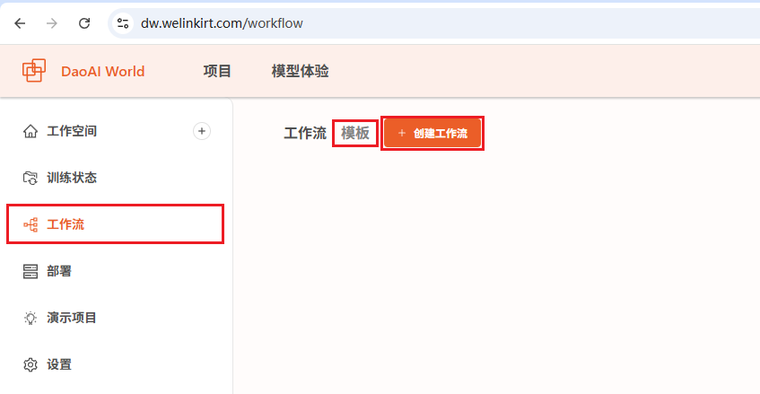

   图 1: 工作流创建页面

工作流界面
-------------

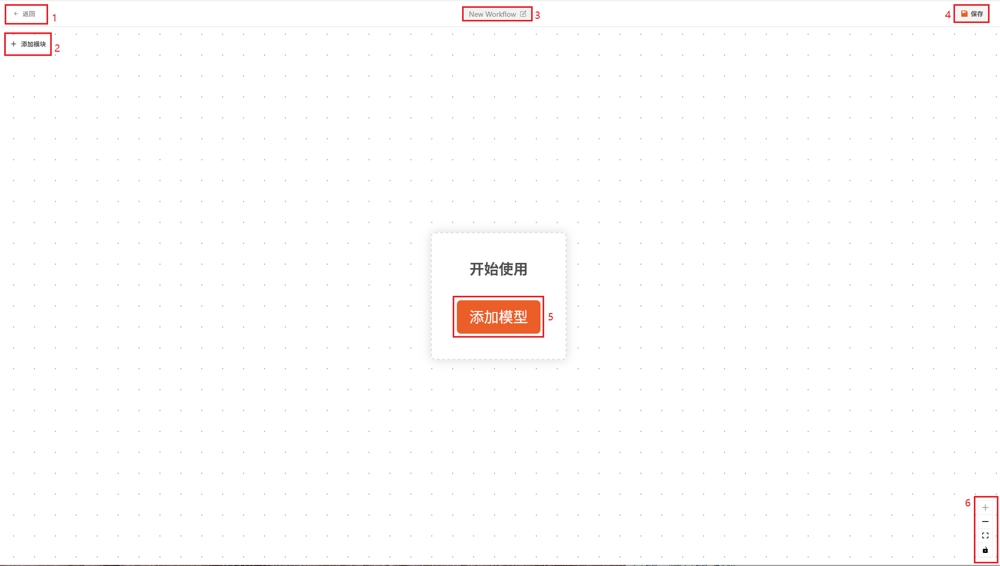

1. 返回
2. 添加模块
3. 重命名
4. 保存
5. 添加一个模块以开始
6. 放大，缩小，适配窗口，锁定模块。

您可以通过滚轮缩放工作流，或者用鼠标拖拽工作流。

模块
---------------

模块分为6个类别，如下图：

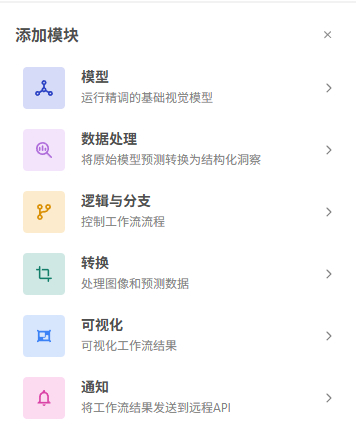

添加模块
~~~~~~~~~

点击左上角的添加模块，点击一个模块来添加。各个模块的详细说明请参考下文。

删除模块
~~~~~~~~~~

点击选中一个模块，然后点击右侧的 ``减号`` 图标来删除

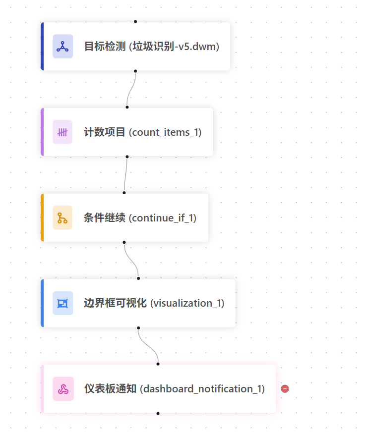

重新连接模块
~~~~~~~~~~~~~~

点击选中一个连接线，点击右侧的 ``减号`` 图标来删除模块之间的连接。

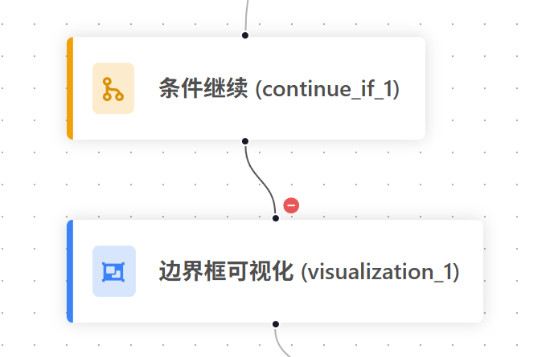

点击模块下方的黑点，然后用鼠标拖拽到需要连接的模块上方，以完成连接。

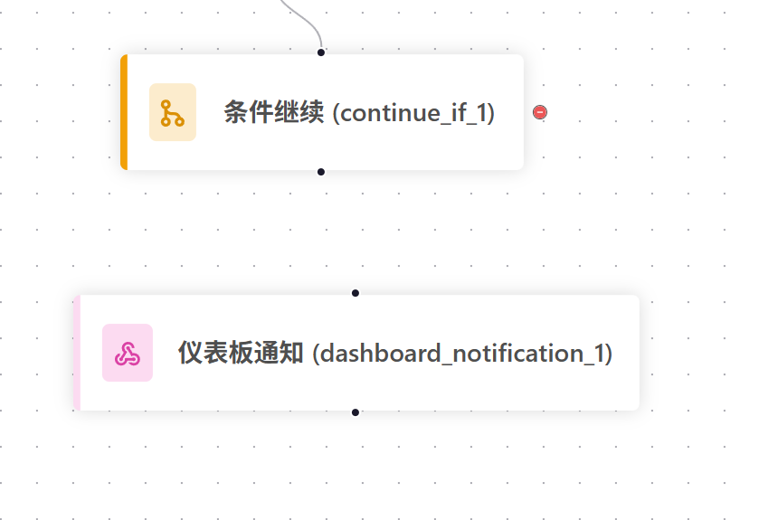

模块的运行顺序是从上往下，顺着连接的模块依次运行。

模型模块
~~~~~~~~~~~~~~~~

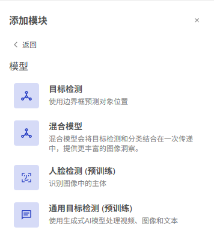

1. :ref:`目标检测` 模块:  可以选择一个在DaoAI 平台上的项目训练的模型, 该模块用于对视频流的帧做目标检测推理。

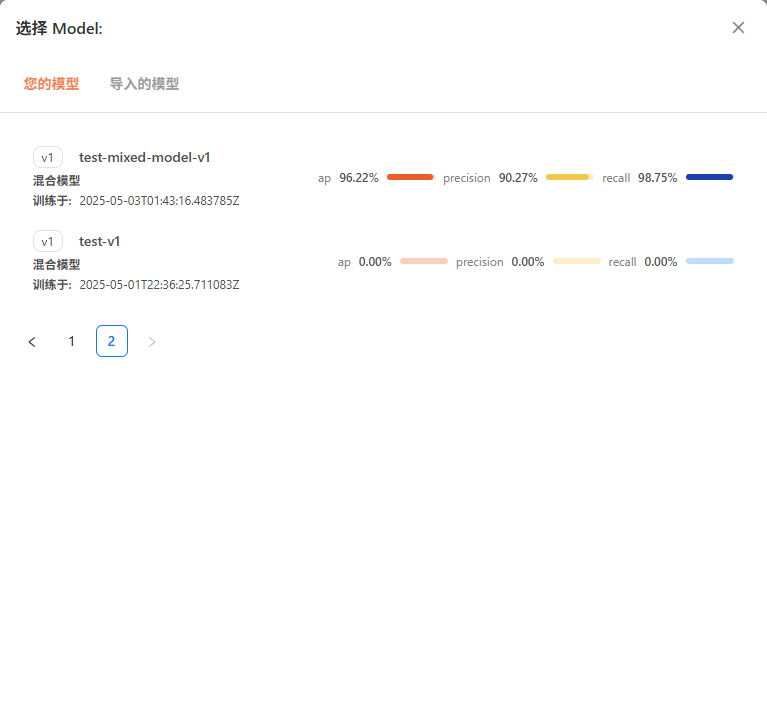

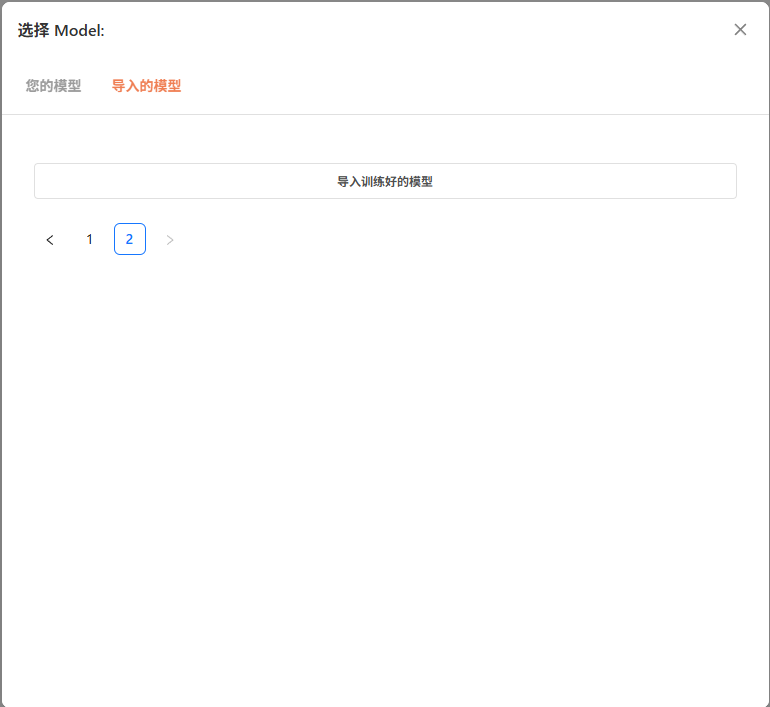

2. :ref:`混合模型` 模块:  可以选择一个在DaoAI 平台上的项目训练的模型, 该模块用于对视频流的帧做目标检测+目标分类推理。

3. **人脸检测模块** ：该模块是预训练的，无需单独训练模型即可使用。使用前需要在人脸身份库中注册人脸信息。详情请参考 :ref:`注册人脸身份`

4. **通用目标检测** : 该模块是预训练的，无需单独训练模型即可使用。使用时仅需要在标签一栏输入您想要检测的标签，该模型会基于标签语义来检测视频流中的对应物体。

    .. image:: images/generic_od.png
        :scale: 70%

.. note::
    创建后，系统将跳转进入工作流编辑界面。

逻辑与分支
~~~~~~~~~~~

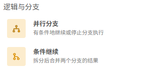

1. **并行分支** : 使用两个线程分别运行两个模型推理。然后再合并结果处，合并线程，等待两个模型推理都结束后，继续下面的模块。

    .. image:: images/parallel_node.png
        :scale: 100%

    .. note::
        工作流默认是单线程的，如果不加并行分支，会按照顺序依次执行模块。如果加了线程，则会多线程同时运行2个模块。

2. **条件继续** : 与设定值比较计数模块的数量，满足时继续运行下面的模块。需要选择要比较的计数节点，然后比较器，然后输出比较值。

    .. image:: images/if.png
        :scale: 100%

转换
~~~~~~~~~~

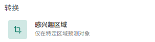

1. **感兴趣的区域** : ROI会限定所有的检测结果都在ROI的区域内，ROI区域外的预测结果会被过滤掉。如何设置ROI请参考 :ref:`设备管理`

    .. note::
        需要使用ROI功能时，需确保 ROI 是工作流的第一个模块。

可视化
~~~~~~~~~~~

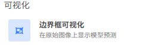

1. **边界框可视化** : 选择添加模型节点，或者对象关系分析的结果的边界框，叠加至视频帧可视化。如果想要显示到大屏，仍需使用 **仪表盘通知** 模块

    .. image:: images/visual.png
        :scale: 100%

通知
~~~~~~~~~~

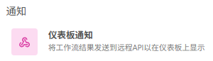

1. **仪表盘通知** : 将选择的消息，可视化模块，推送至监控大屏。推送消息可以是 1.自定义消息，2.使用模型默认输出，或者 3.设置为空。

    可选数据保存的时间 (1天-365天)

    .. image:: images/noti.png
        :scale: 100%

示例工作流
-----------------

1. 混合模型检测没戴头盔模板
~~~~~~~~~~~~~~~~~~~~~~~~~~~~~~~~

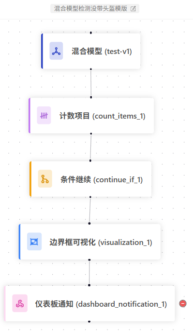

该模板是检测 未佩戴头盔人员数量的工作流

1. 混合模型模块: 使用了一个标注并训练好的混合模型，检测人员并分类，是否佩戴头盔。

2. 计数项目: 统计未佩戴头盔的人员数量

3. 条件继续: 如果数量 大于等于 1， 则说明 检测到人员为佩戴头盔，继续。如条件不满足，则停止，并继续下一帧的检测。

4. 边界框可视化: 绘制出混合模型的检测框，并叠加至当前帧。

5. 仪表盘通知: 将报警信息推送到监控大屏，信息可以是“检测到人员为佩戴头盔”

2. 通用目标检测模板
~~~~~~~~~~~~~~~~~~~~~~~~~~~

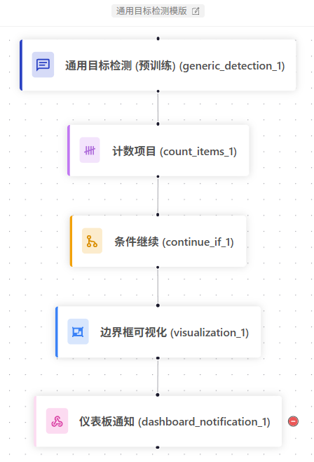

该模板是通用目标检测的模板工作流，可以根据语义输入定义检测目标。无需训练，灵活部署。

1. 通用目标检测: 可以设置任意您想检测的物体，输入 英文标签 到检测目标即可。无需额外训练，模型会根据语义自动检测画面中的物体。

2. 计数项目: 统计通用目标检测的结果

3. 条件继续: 如果数量 大于等于 1， 则说明 检测到目标，继续。如条件不满足，则停止，并继续下一帧的检测。

4. 边界框可视化: 绘制出模型的检测框，并叠加至当前帧。

5. 仪表盘通知: 将报警信息推送到监控大屏，信息可以是“检测到目标”

3. 目标检测模型检测垃圾抛洒模板
~~~~~~~~~~~~~~~~~~~~~~~~~~~~~~~~

该模板是检测 垃圾抛洒物的工作流，也适用于任何目标检测。

1. 目标检测模块: 使用了一个标注并训练好的目标检测模型，检测垃圾抛洒物。

2. 计数项目: 统计垃圾的数量

3. 条件继续: 如果数量 大于等于 1， 则说明 检测到垃圾存在，继续。如条件不满足，则停止，并继续下一帧的检测。

4. 边界框可视化: 绘制出混合模型的检测框，并叠加至当前帧。

5. 仪表盘通知: 将报警信息推送到监控大屏，信息可以是“检测到垃圾，请及时处理”
